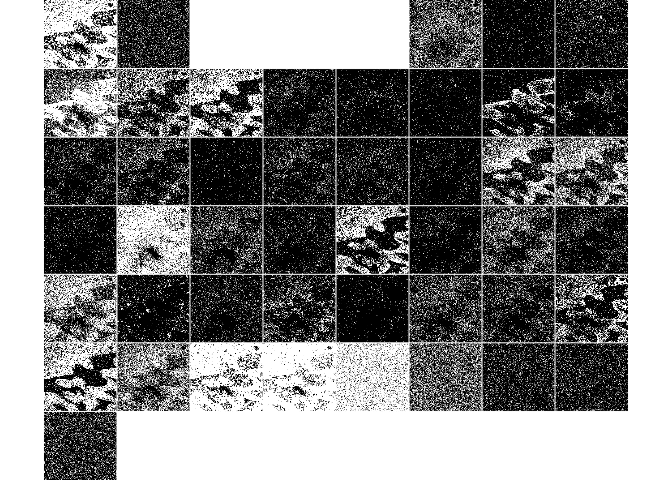

<!-- README.md is generated from README.qmd. Please edit that file -->

# rome

<!-- badges: start -->

[](https://github.com/Huber-group-EMBL/rome/actions/workflows/R-CMD-check.yaml)
<!-- badges: end -->

rome is a minimal R package to read and write multiscale OME-Zarr files.

It also provides helper and methods to manipulate the resulting
`ome_zarr` objects the same way one would manipulate traditional arrays
in R. For example, you can subset an `ome_zarr` object using the `[`
operator, and the subsetting will be applied to all levels of the
multiscale OME-Zarr object.

## Installation

You can install the development version of rome like so:

``` r
# install.packages("pak")
pak::pak("Huber-group-EMBL/rome")
```

## Example

This is a basic example which shows you how to solve a common problem:

``` r
library(rome)
x <- ome_read(
  system.file("extdata", "ome-v0.4", "10501752.zarr", package = "rome")
)
plot(x, all = TRUE)
```


